# ⚙️ OS Orchestrator & Multitasking — Core Systems Architecture & Analytics

An advanced POSIX-compliant systems engineering framework designed to operationalize fundamental Operating System primitives: **concurrency models (`fork()`)**, **Inter-Process Communication (System V Message Queues)**, **automated log analytics (`Bash`/`awk`/`sed`)**, and **CPU process scheduling simulation**.

[](https://en.wikipedia.org/wiki/C_(programming_language))
[](https://www.gnu.org/software/bash/)
[](https://pubs.opengroup.org/onlinepubs/9699919799/)
[](https://opensource.org/licenses/MIT)
[](https://www.upatras.gr/)

---

## 📋 Executive Summary & Technical Vision

Modern multi-core systems demand a clear understanding of low-level process management, synchronization primitives, and resource scheduling. The **OS Orchestrator & Multitasking** framework bridges theoretical system dynamics with high-performance C and Shell implementations. Developed for the Operating Systems course at the **University of Patras (CEID)**, this repository addresses three foundational computing pillars:

1. **High-Throughput Log Data Mining:** Rapid text stream analysis using GNU `awk` associative arrays and `sed` pattern matching to parse web server access logs.
2. **Parallel Numerical Quadrature & IPC:** Distributing mathematical function integration ($\int \ln(x)\sqrt{x}\,dx$) across isolated child process address spaces using `fork()` and aggregating intermediate results via System V Message Queues (`sys/msg.h`).
3. **CPU Scheduling Algorithm Benchmarking:** Empirical and quantitative evaluation of process state transitions under First-Come First-Served (FCFS), Shortest Job First (SJF), Shortest Remaining Time First (SRTF), Round Robin (RR), and Longest Remaining Time First Preemptive (LRTFP) algorithms.

---

## 🏗️ Master Architecture & Data Flow

The system integrates an automated shell parsing engine with a multi-process C integration harness and scheduling simulation logic:

```mermaid
graph TD
    subgraph L1["Layer 1: Shell Log Parsing Engine (logparser.sh)"]
        LogFile[("access.log")] --> PromptCheck{"File & Extension Valid?"}
        PromptCheck -->|"No"| ErrExit["Exit with Error"]
        PromptCheck -->|"Yes"| ArgDispatcher{"Option Dispatcher"}
        
        ArgDispatcher -->|"--usrid"| UserMine["awk Associative User Counter / sed Role Filter"]
        ArgDispatcher -->|"-method"| MethodFilter["sed GET / POST Extractor"]
        ArgDispatcher -->|"--servprot"| IPFilter["sed IPv4 '127.0.0.1' / IPv6 '::1'"]
        ArgDispatcher -->|"--browsers"| BrowserMine["awk Regex Engine: Chrome/Mozilla/Safari/Edg"]
        ArgDispatcher -->|"--datum"| DateFilter["Month Converter & sed Date Extractor"]
    end

    subgraph L2["Layer 2: Parallel C Multiprocessing & IPC"]
        Parent["Parent Aggregator Process"] -->|"ftok & msgget"| MQ[("OS Message Queue")]
        Parent -->|"fork x N"| C1["Child Worker Process 1"]
        Parent -->|"fork x N"| C2["Child Worker Process N"]
        
        C1 -->|"Compute sub-integral (a1, b1)"| SubSum1["I_1 = f(x) dx"]
        C2 -->|"Compute sub-integral (aN, bN)"| SubSumN["I_N = f(x) dx"]
        
        SubSum1 -->|"msgsnd struct msgbuf"| MQ
        SubSumN -->|"msgsnd struct msgbuf"| MQ
        
        MQ -->|"msgrcv"| Parent
        Parent -->|"Sum Sub-integrals & wait"| Result["Final Quadrature Output"]
    end

    subgraph L3["Layer 3: CPU Scheduling Analysis"]
        Jobs["Job Arrival Queue"] --> Scheduler{"CPU Scheduler"}
        Scheduler -->|"Non-Preemptive"| FCFS_SJF["FCFS / SJF"]
        Scheduler -->|"Preemptive"| SRTF_RR_LRTF["SRTF / Round Robin / LRTFP"]
        FCFS_SJF --> Metrics["Calculate Waiting Time, Turnaround Time & Overhead"]
        SRTF_RR_LRTF --> Metrics
    end
```



---

## 🔍 Deep Technical Component Breakdown

### 1. Automated Server Log Analytics Engine (`src/scripts/logparser.sh`)

The log parser is written in POSIX Bash, utilizing low-overhead stream processing to parse standard server `access.log` structures without loading whole files into volatile memory.

#### Command Line Interface & Options Matrix

| Flag / Parameter | Argument Required | Internal Tool | Mathematical / Logic Operation |
| :--- | :--- | :--- | :--- |
| *(None)* | *None* | `echo` | Outputs team student registration IDs (`1084660\|1084624\|1059656`). Exits with code `0`. |
| `$1` *(Default)* | File Path | `while read` | Checks if `$2` is empty; if so, streams the entire log line-by-line using `IFS=$'\n'`. |
| `--usrid` | Optional `[ROLE]` | `awk` / `sed` | If no role specified, builds `user_counts[$3]++` associative array and sorts by user. If role (`root`, `admin`, `user1`, `user2`, `user3`, `president`) provided, executes `sed -n '/<role>/p'`. |
| `-method` | `GET` \| `POST` | `sed` | Enforces exact HTTP method validation (`GET` or `POST`) and extracts matches with `sed -n '/<METHOD>/p'`. |
| `--servprot` | `IPv4` \| `IPv6` | `sed` | Translates protocol flags to IP pattern equivalents (`IPv4` $\rightarrow$ `127.0.0.1`, `IPv6` $\rightarrow$ `::1`) and streams matching lines. |
| `--browsers` | *None* | `awk` + Regex | Scans line strings with `match($0, "Mozilla|Chrome|Safari|Edg")`, increments `browser_counts`, and sorts numerically (`sort -n`). |
| `--datum` | `[Jan...Dec]` | Regex + `sed` | Case-insensitive regex normalization (`^[Jj][Aa][Nn]$` $\rightarrow$ `Jan`) followed by `sed -n '/<MONTH>/p'` filter. |

#### Code Highlights & POSIX Mechanics

* **Interactive File Extension Validation:**
  ```bash
  echo "Give the filename with the correct extantion:"
  read filename
  if [ "${filename: -4}" != ".log" ]; then
      echo "Wrong File Argument"
      exit 1
  fi
  ```
* **High-Efficiency Associative Array Aggregation (`awk`):**
  ```awk
  awk '{ user_counts[$3]++ } END {
      for(user in user_counts) {
          printf "%d %s\n", user_counts[user], user
      }
  }' "$1" | sort -k 2
  ```

---

### 2. POSIX Multiprocessing & Parallel Numerical Integration (`src/parallel_integration.c`)

To demonstrate concurrent execution under Linux/POSIX, the project formulates parallel numerical integration over an interval $[a, b] = [1.0, 4.0]$ for the non-trivial function:

$$f(x) = \ln(x) \cdot \sqrt{x}$$

#### Step-by-Step Implementation Workflow (8-Step Pipeline)

1. **Step 1 — Queue Creation & Message Struct:** The master process allocates a System V Message Queue using `msgget(key, IPC_CREAT | 0666)` based on an IPC key generated via `ftok("/tmp", 'a')`. A custom data structure `struct message` is declared:
   ```c
   struct message {
       long type;      /* Message tag identifier (1-based process index) */
       double result;  /* Sub-integral calculation payload */
   };
   ```
2. **Step 2 — Process Replication (`fork()`):** Using a `for` loop, `fork()` spawns `num_processes` child worker nodes.
3. **Step 3 — Sub-Interval Computation (`integrate()`):** Each child process calculates its specific sub-range $[a_i, b_i]$ over $N_{\text{sub}}$ steps:
   $$a_i = a + i \cdot \Delta x, \quad b_i = a_i + \Delta x, \quad \text{where } \Delta x = \frac{b - a}{\text{num-processes}}$$
4. **Step 4 — Result Transmission (`msgsnd()`):** Worker nodes pack their partial quadrature result into `struct message` and send it to the queue via `msgsnd(msgid, &msg, sizeof(msg) - sizeof(long), 0)` before exiting (`exit(EXIT_SUCCESS)`).
5. **Step 5 — Parent Result Retrieval (`msgrcv()`):** The parent process iterates `num_processes` times, invoking `msgrcv(msgid, &msg, sizeof(msg) - sizeof(long), 0, 0)` to receive incoming calculation payloads.
6. **Step 6 — Partial Result Accumulation:** The parent accumulates all partial integrals into `total += msg.result`.
7. **Step 7 — Wall-Clock Execution Measurement (`get_wtime()`):** Execution wall-clock time is calculated with microsecond accuracy via `gettimeofday(&t, NULL)`, and parent reaps all child worker exit statuses using `wait(NULL)`.
8. **Step 8 — IPC Queue Deallocation (`msgctl()`):** The parent calls `msgctl(msgid, IPC_RMID, NULL)` to remove the message queue from kernel memory.

#### Complete C Source Code Reference (`src/parallel_integration.c`)

```c
#include <stdio.h>
#include <stdlib.h>
#include <unistd.h>
#include <sys/types.h>
#include <sys/ipc.h>
#include <sys/msg.h>
#include <sys/wait.h>
#include <math.h>
#include <sys/time.h>

struct message {
    long type;
    double result;
};

double f(double x) {
    return log(x) * sqrt(x);
}

double integrate(double a, double b, unsigned long n) {
    double dx = (b - a) / n;
    double S = 0.0;
    for (unsigned long i = 0; i < n; i++) {
        double xi = a + (i + 0.5) * dx;
        S += f(xi);
    }
    S *= dx;
    return S;
}

double get_wtime(void) {
    struct timeval t;
    gettimeofday(&t, NULL);
    return (double)t.tv_sec + (double)t.tv_usec * 1.0e-6;
}

int main(int argc, char *argv[]) {
    int num_processes = argc > 1 ? atoi(argv[1]) : 1;

    key_t key = ftok("/tmp", 'a');
    int msgid = msgget(key, IPC_CREAT | 0666);
    if (msgid < 0) {
        perror("msgget");
        exit(EXIT_FAILURE);
    }

    double start_a = 1.0, end_b = 4.0;
    unsigned long total_n = 100000000UL;
    double step_size = (end_b - start_a) / num_processes;
    unsigned long steps_per_process = total_n / num_processes;

    for (int i = 0; i < num_processes; i++) {
        if (fork() == 0) {
            double child_a = start_a + i * step_size;
            double child_b = child_a + step_size;
            double result = integrate(child_a, child_b, steps_per_process);
            struct message msg = { i + 1, result };
            msgsnd(msgid, &msg, sizeof(struct message) - sizeof(long), 0);
            exit(EXIT_SUCCESS);
        }
    }

    double total = 0.0;
    double t0 = get_wtime();
    for (int i = 0; i < num_processes; i++) {
        struct message msg;
        msgrcv(msgid, &msg, sizeof(struct message) - sizeof(long), 0, 0);
        total += msg.result;
    }
    double t1 = get_wtime();
    for (int i = 0; i < num_processes; i++) wait(NULL);

    printf("Processes: %d | Result: %.10f | Time: %.6f sec\n", num_processes, total, t1 - t0);
    msgctl(msgid, IPC_RMID, NULL);
    return 0;
}
```

---

### 3. Inter-Process Communication (IPC) & C Header Reference

#### C Header Files & System API Mapping

| Header File | Target System Functionality & Macros |
| :--- | :--- |
| `<stdio.h>` | Standard I/O operations (`printf`, `perror`, `fprintf`). |
| `<stdlib.h>` | Utility functions (`malloc`, `free`, `exit`, `atoi`, `EXIT_SUCCESS`, `EXIT_FAILURE`). |
| `<unistd.h>` | Core POSIX system calls (`fork`, `exec`, `sleep`, `getpid`). |
| `<sys/types.h>`| Primitive OS data types (`pid_t`, `key_t`, `size_t`). |
| `<sys/ipc.h>` | Inter-Process Communication constants & structures (`ftok`, `key_t`, `IPC_CREAT`). |
| `<sys/msg.h>` | System V Message Queue functions (`msgget`, `msgsnd`, `msgrcv`, `msgctl`, `IPC_RMID`). |
| `<math.h>` | Mathematical functions (`log`, `sqrt`, `pow`, `M_PI`). Requires `-lm` link flag. |
| `<sys/time.h>` | High-resolution wall-clock timer structure (`struct timeval`, `gettimeofday`). |

---

### 4. CPU Scheduling Algorithms & Empirical Analysis

The theoretical framework in `docs/Project Operating Systems.pdf` evaluates process state management across standard and preemptive scheduling policies:

| Scheduling Policy | Type | Selection Criteria | Preemptive? | Context Switch Overhead | Starvation Risk |
| :--- | :--- | :--- | :--- | :--- | :--- |
| **First-Come, First-Served (FCFS)** | Non-Preemptive | Arrival Time ($T_{arrival}$) | No | Lowest | Low (Convoy effect possible) |
| **Shortest Job First (SJF)** | Non-Preemptive | Burst Time ($T_{burst}$) | No | Low | High (for long processes) |
| **Shortest Remaining Time First (SRTF)** | Preemptive | Remaining CPU Time | Yes | High | High (for long processes) |
| **Round Robin (RR)** | Preemptive | Time Quantum ($q$) | Yes | Medium / Quantum-Dependent | None (Fair allocation) |
| **Longest Remaining Time First (LRTFP)**| Preemptive | Max Remaining Time | Yes | High | High (for short processes) |

#### Analytical Metrics Formulae

* **Turnaround Time ($TAT$):** $TAT = T_{\text{completion}} - T_{\text{arrival}}$
* **Waiting Time ($WT$):** $WT = TAT - T_{\text{burst}}$
* **Response Time ($RT$):** $RT = T_{\text{first-cpu-execution}} - T_{\text{arrival}}$
* **CPU Utilization:** $\eta = \frac{\sum T_{\text{burst}}}{\text{Total Schedule Time}} \times 100\%$

---

## 📂 Project Directory Structure

```text
os-orchestrator-multitasking/
├── README.md                          # ⚙️ Primary Engineering & Analytical Specification
├── .gitignore                         # Version control exclusion rules
├── assets/                            # System demonstrations & media
│   └── How_Your_Computer_Juggles_Everything.mp4  # Explanatory OS multitasking video
├── docs/                              # Theoretical foundations & academic project briefs
│   ├── Operating_Systems_Assignment_1.docx       # Assignment 1 specification
│   └── Project Operating Systems.pdf            # Comprehensive CPU scheduling & IPC report
└── src/
    ├── parallel_integration.c         # ⚡ Multiprocessing C Numerical Integration & Message Queue IPC
    └── scripts/
        └── logparser.sh               # 🔍 Automated Server Log Parser Engine
```

---

## 🚀 Installation & Usage Guide

### Prerequisites

* **Operating System:** Linux, macOS, or Windows with WSL2 / Cygwin / MSYS2.
* **Shell Environment:** Bash 4.0 or higher.
* **Core Utilities:** GNU `awk` (`gawk`), GNU `sed`, `sort`.
* **C Compiler (for C modules):** GCC 7.0+ or Clang 10.0+ with POSIX flags (`-std=c11 -lm`).

### 1. Clone Repository & Setup

```bash
git clone https://github.com/FilippeZ/os-orchestrator-multitasking.git
cd os-orchestrator-multitasking
chmod +x src/scripts/logparser.sh
```

### 2. Compiling & Running Parallel C Integration

```bash
# Compile parallel C numerical integration module
gcc -O3 src/parallel_integration.c -o parallel_integration -lm

# Run with 1 worker process (Sequential execution)
./parallel_integration 1

# Run with 4 concurrent worker processes (Parallel execution)
./parallel_integration 4

# Run with 8 concurrent worker processes
./parallel_integration 8
```

### 3. Executing Log Parser Commands

```bash
# View Team Student AM IDs
./src/scripts/logparser.sh

# Interactive prompt mode (Enter access.log when prompted)
./src/scripts/logparser.sh access.log

# Extract user counts across all log entries
./src/scripts/logparser.sh access.log --usrid

# Filter log entries for a specific role (e.g., admin, root, president)
./src/scripts/logparser.sh access.log --usrid admin

# Filter log entries by HTTP method (GET or POST)
./src/scripts/logparser.sh access.log -method GET

# Filter by network protocol version
./src/scripts/logparser.sh access.log --servprot IPv4
./src/scripts/logparser.sh access.log --servprot IPv6

# Count and rank browser user-agents
./src/scripts/logparser.sh access.log --browsers

# Filter log entries by month (case-insensitive)
./src/scripts/logparser.sh access.log --datum Jan
```

---

## 🛡️ Edge Cases & Robustness Controls

1. **File Path Validation:** `logparser.sh` explicitly validates existence (`[ ! -f "$1" ]`) and `.log` file extension before reading.
2. **Strict Protocol Validation:** Arguments for `-method` and `--servprot` strictly validate inputs using Bash `case` statements, exiting with status `1` on malformed inputs.
3. **IPC Resource Leak Protection:** System V message queues are cleaned up via `msgctl(msgid, IPC_RMID, NULL)` to prevent orphaned IPC objects in kernel space.
4. **Zombie Process Prevention:** Parent processes issue `wait(NULL)` or `waitpid()` calls for all spawned children before terminating.

---

## 📚 References & Documentation Assets

* **Video Asset:** `assets/How_Your_Computer_Juggles_Everything.mp4` — Visual walkthrough of CPU process multiplexing and context switching.
* **Detailed Project Report:** `docs/Project Operating Systems.pdf` — Contains raw benchmarks, Gantt charts, and scheduling algorithm metrics.
* **Assignment Brief:** `docs/Operating_Systems_Assignment_1.docx` — Official course specification requirements.

---

## 👥 Authors & Academic Accreditation

Developed as part of the **Operating Systems** course (2022–2023) at the **Department of Computer Engineering & Informatics (CEID), University of Patras**.

* **Filippos-Paraskevas Zygouris** — *Student ID: 1084660* ([GitHub](https://github.com/FilippeZ))
* **Niki-Aikaterini Kyriakatou** — *Student ID: 1084624*
* **Maria-Anastasia Kyriakatou** — *Student ID: 1059656*

---

## 📄 License

This repository is distributed under the [MIT License](https://opensource.org/licenses/MIT). Academic use is encouraged with appropriate attribution.

